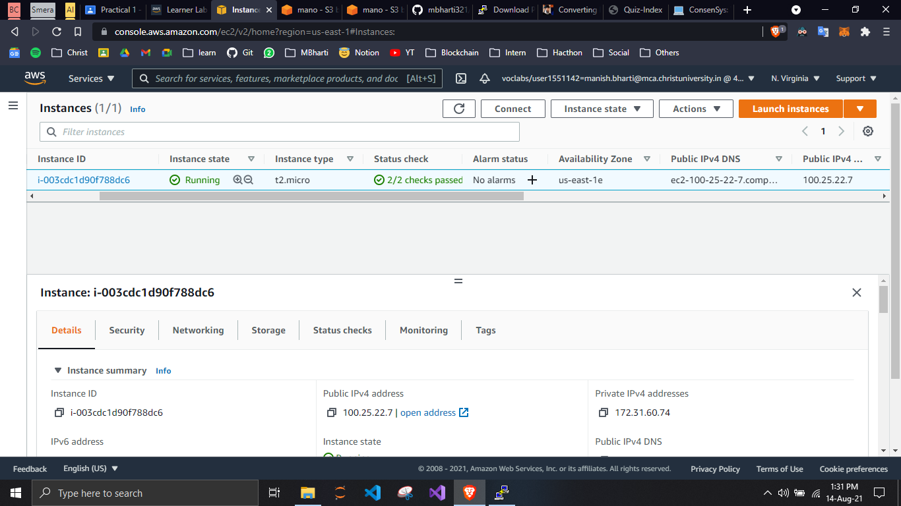
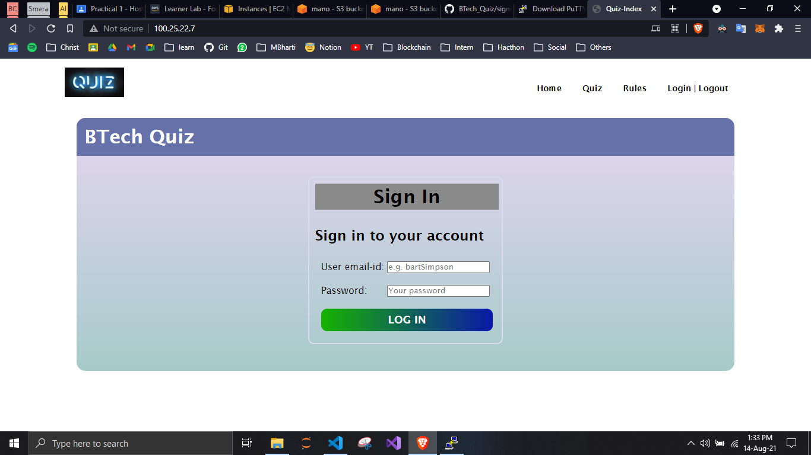
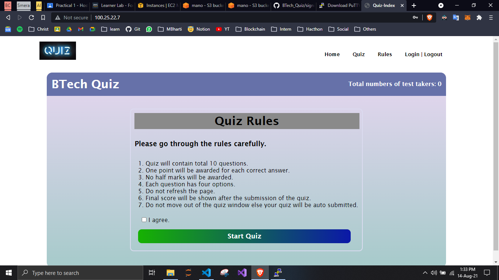
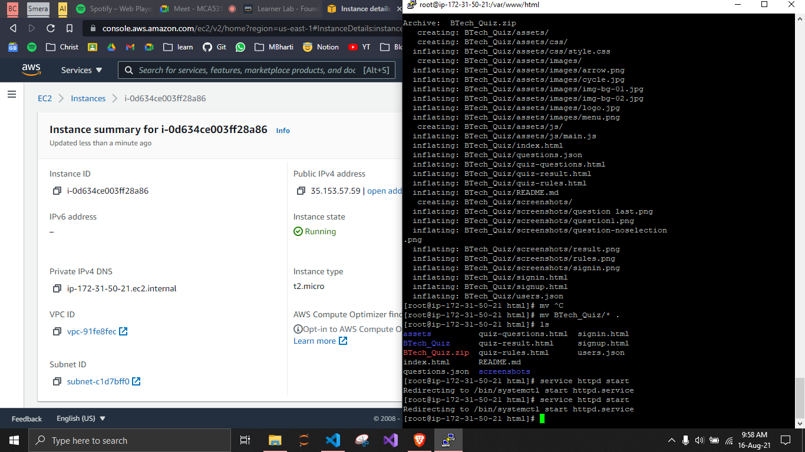

## LAB - Hosting a website using Compute Service (EC2)

### Hosting Link
- [BTech_Quiz: http://100.25.22.7/](http://100.25.22.7/)
- http://35.153.57.59/

## Screenshots
  ### 1. EC2 Instance
  

  ### 2. Index Page
  

  ### 3. Rules Page
  

  ### 4. SSH Terminal
  